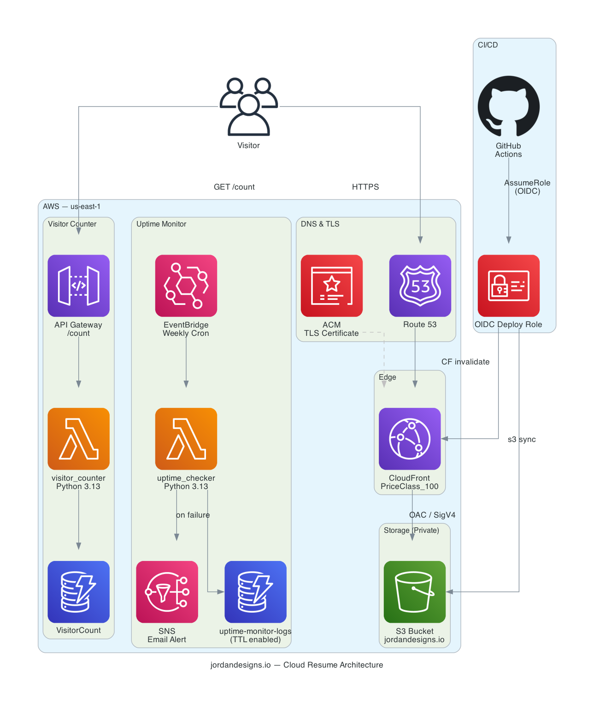

# Cloud Resume Challenge — [jordandesigns.io](https://jordandesigns.io)

[](https://github.com/jordann6/cloud-resume-challenge/actions/workflows/deploy.yml)

Portfolio site built as an implementation of Forrest Brazeal's Cloud Resume Challenge. Serverless architecture on AWS with automated deployments, real-time visitor tracking, and all infrastructure defined as code in Terraform.

## Architecture



| Layer | Services |
|---|---|
| DNS & TLS | Route 53 · ACM (TLSv1.2+) |
| Edge | CloudFront (OAC · HTTPS-only · compress · IPv6) |
| Storage | S3 (private bucket · AES-256 SSE · OAC-only access) |
| Visitor Counter | API Gateway → Lambda (Python 3.13) → DynamoDB |
| CI/CD | GitHub Actions → OIDC → IAM role → S3 sync + CF invalidation |
| IaC | Terraform (remote state: S3) |

## Project Structure

```
cloud-resume-challenge/
├── index.html                  # Portfolio site
├── main.css                    # Styling
├── script.js                   # Visitor counter + UI logic
├── diagram.py                  # Architecture diagram (diagrams-as-code)
├── architecture.png            # Generated architecture diagram
├── assets/                     # Cert badges
├── backend/
│   └── lambda_function.py      # Visitor counter Lambda
├── infrastructure/
│   └── terraform/
│       ├── main.tf             # DynamoDB, Lambda, API Gateway, IAM
│       ├── cloudfront.tf       # CloudFront distribution + OAC
│       ├── s3.tf               # S3 bucket + policy
│       ├── route53.tf          # DNS A alias record
│       ├── acm.tf              # TLS certificate
│       ├── github_oidc.tf      # GitHub Actions OIDC provider + role
│       ├── variables.tf
│       └── provider.tf         # S3 backend + provider config
└── .github/
    └── workflows/
        └── deploy.yml          # CI/CD pipeline
```

## Deployment

Every push to `main` triggers the CI/CD pipeline:

1. GitHub Actions assumes the `github-actions-deploy` IAM role via OIDC (no stored AWS keys)
2. `aws s3 sync` uploads changed files to S3 with `max-age=60` cache headers
3. CloudFront cache invalidation ensures visitors see the latest content immediately

To deploy infrastructure changes:

```bash
cd infrastructure/terraform
terraform init
terraform plan
terraform apply
```

To regenerate the architecture diagram:

```bash
pip install diagrams
python3 diagram.py
```

## Security

- S3 bucket is fully private — accessible only by CloudFront via Origin Access Control (SigV4 signed requests)
- CloudFront enforces HTTPS and TLSv1.2 minimum for all viewers
- Lambda IAM role scoped to `dynamodb:UpdateItem` on a single table
- GitHub Actions uses short-lived OIDC tokens — no long-lived AWS credentials stored
- CORS on the visitor counter API locked to `https://jordandesigns.io`
- Terraform remote state stored in S3 (`tf-backend-jord-projs`)

## Tech Stack

`S3` `CloudFront` `Route 53` `ACM` `API Gateway` `Lambda` `DynamoDB` `IAM` `Terraform` `GitHub Actions` `Python` `HTML/CSS/JS`

## Contact

| | |
|---|---|
| Email | jordandn6@outlook.com |
| GitHub | [github.com/jordann6](https://github.com/jordann6) |
| LinkedIn | [linkedin.com/in/jordan-nelson-aa0828165](https://linkedin.com/in/jordan-nelson-aa0828165) |
| Portfolio | [jordandesigns.io](https://jordandesigns.io) |
