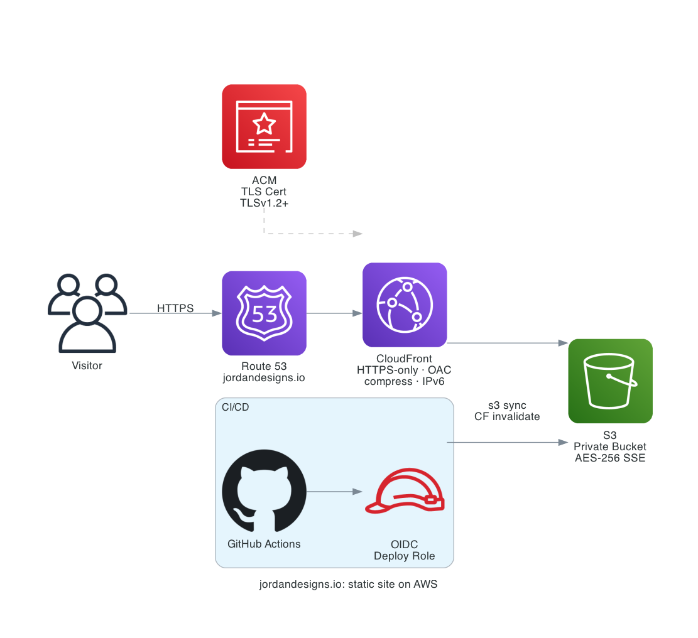

# [jordandesigns.io](https://jordandesigns.io)

[](https://github.com/jordann6/jd/actions/workflows/deploy.yml)

Portfolio site, an evolution of Forrest Brazeal's Cloud Resume Challenge. Built with Next.js (App Router) as a static export served from S3 through CloudFront, with automated deployments and all infrastructure defined as code in Terraform. The original visitor counter (API Gateway, Lambda, DynamoDB) was retired in October 2026.

## Architecture



| Layer | Services |
|---|---|
| DNS & TLS | Route 53 · ACM (TLSv1.2+) |
| Edge | CloudFront (OAC · HTTPS-only · compress · IPv6 · security headers · index-rewrite function) |
| Storage | S3 (private bucket · AES-256 SSE · OAC-only access) |
| CI/CD | GitHub Actions → OIDC → IAM role → S3 sync + CF invalidation |
| IaC | Terraform (remote state: S3) |

## Project Structure

```
jd/                                    # Next.js (App Router), static export
├── app/
│   ├── layout.tsx                     # Root layout: fonts, site chrome, metadata
│   ├── page.tsx                       # Home (hero, solutions, services, approach, about, contact)
│   ├── site.css                       # Design system + styles
│   ├── icon.svg                       # jd favicon
│   ├── not-found.tsx                  # 404 page
│   └── work/
│       ├── page.tsx                   # Full project index
│       ├── case-studies/page.tsx      # Case-study index
│       ├── [slug]/page.tsx            # Deep case-study pages
│       └── category/[cat]/page.tsx    # Shareable per-category pages (aws/azure/ai/platform)
├── components/                        # home/ (sections, dialog, brand marks), ProjectIndex, CalendlyEmbed
├── lib/                               # projects, caseStudies, diagrams, architecture, solutions
├── public/diagrams/                   # Architecture diagrams copied from each case study repo
├── infrastructure/
│   └── terraform/
│       ├── cloudfront.tf              # CloudFront: OAC, index-rewrite fn, security headers
│       ├── s3.tf                      # Private S3 bucket + policy
│       ├── route53.tf                 # DNS A alias record
│       ├── acm.tf                     # TLS certificate
│       ├── github_oidc.tf             # GitHub Actions OIDC provider + role
│       ├── variables.tf
│       └── provider.tf                # S3 backend + provider config
├── diagram.py                         # Architecture diagram (diagrams-as-code)
├── next.config.mjs                    # output: 'export'
└── .github/
    └── workflows/
        └── deploy.yml                 # CI/CD: build → S3 sync → CF invalidation
```

## Deployment

Every push to `main` triggers the CI/CD pipeline:

1. GitHub Actions assumes the `github-actions-deploy` IAM role via OIDC (no stored AWS keys)
2. `npm ci && npm run build` produces the static export in `out/`
3. `aws s3 sync` uploads `out/` to S3 (immutable long cache on hashed assets, short cache on HTML)
4. CloudFront cache invalidation ensures visitors see the latest content immediately

To deploy infrastructure changes:

```bash
cd infrastructure/terraform
terraform init
terraform plan
terraform apply
```

To regenerate the architecture diagram:

```bash
pip install diagrams
python3 diagram.py
```

## Security

- S3 bucket is fully private — accessible only by CloudFront via Origin Access Control (SigV4 signed requests)
- CloudFront enforces HTTPS and TLSv1.2 minimum for all viewers
- GitHub Actions uses short-lived OIDC tokens — no long-lived AWS credentials stored
- Terraform remote state stored in S3 (`tf-backend-jord-projs`)

## Tech Stack

`Next.js` `React` `TypeScript` `S3` `CloudFront` `Route 53` `ACM` `IAM` `Terraform` `GitHub Actions`

## Contact

| | |
|---|---|
| Email | jordandn6@outlook.com |
| GitHub | [github.com/jordann6](https://github.com/jordann6) |
| LinkedIn | [linkedin.com/in/jordan-nelson-aa0828165](https://www.linkedin.com/in/jordan-nelson-aa0828165/) |
| Portfolio | [jordandesigns.io](https://jordandesigns.io) |
